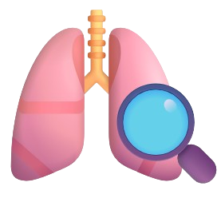
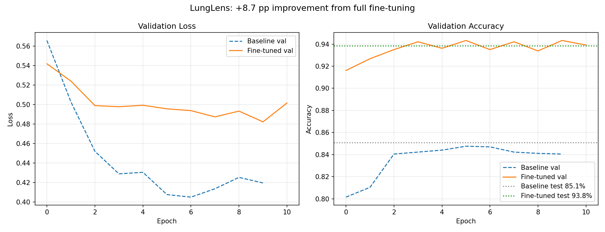

<div align="center">



# LungLens: chest X-ray classification with explainable AI

    

</div>

---

**LungLens** is a transfer-learning pipeline that fine-tunes a pretrained **ResNet-18** on the COVID-19 Radiography dataset (4 classes: COVID, Lung Opacity, Normal, Viral Pneumonia). It documents an honest **frozen-backbone baseline vs full fine-tuning** comparison with differential learning rates, and serves the model through a **Dockerized FastAPI + React** app with **Grad-CAM explainability** — the heatmap shows *where the model looked* when making its call.

> ⚠️ Research/portfolio demo — not a medical device.

## 🧰 Technologies Used

### 📊 Data Science & Machine Learning
   

### 📈 Data Visualization


### 🚀 MLOps & Deployment
 

### 🌐 Web Development
     

### 🛠️ Tools


## 📊 Results


<div align="center">

| Metric | Baseline (frozen backbone) | Fine-tuned (all layers) |
|:---:|:---:|:---:|
| **Test accuracy** | **85.10%** | **93.84%** |
| Test error | 14.90% | 6.16% (**−59% error reduction**) |
| Best val accuracy | 84.76% | 94.33% |
| Trainable params | 2,052 (fc head only) | 11,178,564 |
| Train time (Colab T4) | 11.4 min | 21.3 min (early-stopped @ epoch 12) |
| Augmentation / Scheduler | none / none | flips+rotation+jitter / CosineAnnealing |

</div>

Fine-tuning all layers with differential learning rates (`1e-5` → `1e-4` → `1e-3` from early layers to head) improved test accuracy by **+8.74 percentage points** and cut the error rate by **59%** vs the frozen-backbone baseline.

<div align="center">

</div>

Full transparency artifacts in [results/](results/): per-epoch JSON histories, curves, confusion matrices, and the auto-generated [comparison.md](results/comparison.md).

## 🔍 Explainability

The `/explain` endpoint runs **Grad-CAM** on ResNet-18's last conv block (`layer4[-1]`): gradients of the predicted class score weight the spatial feature maps, producing a heatmap of the lung regions that most influenced the prediction. It shows *where the model looked* — not a clinical justification.

## 📁 Project structure

```
notebooks/
  01_baseline_training.ipynb    # frozen backbone, fc head only (run on Colab GPU)
  02_finetune_training.ipynb    # differential LRs + early stopping + model export
backend/                        # FastAPI app
  global_variables/             #   config + model store (loads model once at startup)
  logger/  middleware/  routes/  schema/   # predict / explain / health
  saved_models/                 #   exported lunglens_resnet18.pt + classes.json
  App.py  Server.py  api_requirements.txt
frontend/                       # React (Vite) UI with Grad-CAM viewer
results/                        # training histories + comparison artifacts
Dockerfile                      # builds frontend + serves backend in one image
```

## 🚀 Workflow

### 1. Train on Colab (GPU)
Open the notebooks with the Colab VS Code extension (or colab.research.google.com), select a GPU runtime, and run:
1. `notebooks/01_baseline_training.ipynb` (~25–30 min) — needs your Kaggle API key for the dataset download
2. `notebooks/02_finetune_training.ipynb` (~40–60 min)

Download `lunglens_artifacts.zip` from the last cell (via Google Drive if using the VS Code kernel) and extract: `results/*` → `results/`, model files → `backend/saved_models/`.

### 2. Run the API locally
```bash
pip install -r requirements.txt
cd backend
python Server.py            # -> http://localhost:7860 (set PORT=8000 to change)
```
Interactive docs at `/docs`. Endpoints:
- `GET /health` — status + loaded classes
- `POST /predict` — multipart image upload → class, confidence, full probabilities
- `POST /explain` — same input → prediction + base64 Grad-CAM heatmap PNG

### 3. Run the frontend (dev)
```bash
cd frontend
npm install
npm run dev                 # -> http://localhost:5173 (proxies API to :8000)
```
For dev, run the API on port 8000 from `backend/`: `PORT=8000 python Server.py` (PowerShell: `$env:PORT=8000; python Server.py`).

### 4. Docker (API + built frontend in one image)
```bash
docker build -t lunglens .
docker run -p 7860:7860 lunglens
```
Open http://localhost:7860 — the React UI and API are served from the same container.

### 5. Deploy to Hugging Face Spaces
1. Create a new Space → **Docker** SDK.
2. Push this repo to the Space (the YAML frontmatter above configures it). The model file must be included — either commit `backend/saved_models/lunglens_resnet18.pt` with Git LFS (`git lfs track "*.pt"`) or upload it via the Space UI.
3. The Space builds the Dockerfile and serves the app publicly on port 7860.
